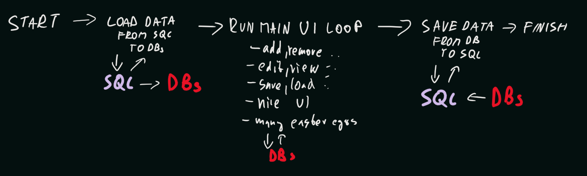

# Filmova Databaze
---
## Zakladni Prehled
- databaze pro spravu seznamu filmu
- film:
    - reziser, rok vydani, seznam hercu/animatoru, hodnoceni - bodove, slovni
    - dva typy filmu
xdfhgdfgfgdfgfsghgdf        - hrane
            - herci jako herci
            - bodove hodnoceni 1 - 5 (hvezdicky)
        - animovane
            - herci jako daberi
            - bodove hodnoceni jako 1 - 10 (kladne cislo)
            - navic doporuceny vek divaka

## Funkce
- pridani filmu
    - uzivatel vyber druh filmu
    - zada nazev, rezisera, rok vydani, seznam hercu, animatoru
    - pokud animovany - zada navic i doporuceny vek divaka
- upraveni filmu
    - uzivatel film vybere dle nazvu
    - muze upravit nazev, rezisera, rok vydani, seznam hercu/ animatoru
    - pokud animovany - muze menit i doporuceny vek divaka
- smazani filmu
    - vyber dle jmena
- pridani hodnoceni
    - dle jmena
    - bodove hodnoceni dle druhu filmu, slovni hodnoceni volitelne
- vypis filmu
    - zobrazeni vsech filmu v seznamu
    - nazev, reziser, rok vydani, seznam hercu / animatoru, hodnoceni divaku - razeno sestupne dle hodnoceni
- vypis hercu / animatoru podilejicich se na vice nez jednom filmu
    - uzivateli zobrazen seznam hercu / animatoru, kteri se podileli na vice filmech
    - vybere jednoho
    - zobrazi se mu seznam filmu na kterem se podileli
- vypis vsech filmu s konkretnim hercem / animatorem
    - uzivatel zada jmeno
    - zobrazi se seznam filmu na kterem se podileli
- ulozeni informace o vybranem filmu (vyber dle nazvu) do souboru
- nacteni vsech informaci o danem filmu ze souboru (jeden soubor = jeden film)
- ukonceni - ulozeni do sql
- spusteni - nacteni ze sql

## Struktura
- abstract class Crew
    - class Actor extends Crew
    - class Animator extends Crew
    - class ? Director extends Crew ?? mit jej jako ptomka crew nebo samostatne, ci jen jako string jmena?
- abstract class Review
    - class AnimatedFilmReview extends Review
    - class ActedFilmReview extends Review
- abstract class Film
    - class ActedFilm extends Film
    - class AnimatedFilm extends Film
    - moznost A
        - v kazdem filmu je seznam odkazu na jeho herce/animatory/rezisera a hodnoceni do jinych db
    - obsahuje metody zjednodusujici praci s daty
- FilmDB class - implements SQLDataProvider
    - obsahuje metody pro praci s filmy
    - obsahuje databazi vsech filmu
- ReviewDB class - implements SQLDataProvider
    - obshauje metody pro praci s hodnocenimi
    - obsahuje databazi vsech hodnoceni
- CrewDB class - implements SQLDataProvider
    - obshauje metody pro praci herci/animatory/rezisery
    - obsahuje databazi vsech crewMembers
- AllDBHandler class
    - pracuje a obsahuje
- SQLDataProvider interface
    - obsahuje sadu funkci pro zjednoduseni praci s sql - funcke pro hromadne ziskani a ulozeni dat
- SQLHandler class
    - stara se o nacitani / ukladani dat sql-interni databaze

---

---
## TODO
- [ ] Uzivatelske rozhrani - @Windar11
    - [ ] pridani filmu
    - [ ] uprava filmu
    - [ ] smazani filmu
    - [ ] pridani hodnoceni
    - [ ] vypis filmu
    - [ ] vypis hercu s vice filmy
    - [ ] vypis filmu s konkretnim hercem
    - [ ] ulozeni informace o jednom filmu do souboru
    - [ ] nacteni informace o jednom filmu ze souboru
    - [ ] ui polish
    - [ ] vyuziti sql loading / saving
- [ ] Databaze, datove typy, zprostredkovatele - @Otas02CZ
    - [x] review a potomci
    - [x] film a potomci
    - [x] crew a potomci
    - [ ] FilmDB
    - [ ] CrewDB
    - [ ] ReviewDB
    - [ ] SQLHandler
    - [ ] SQLDataProvider
    - [ ] DatabaseBackend
